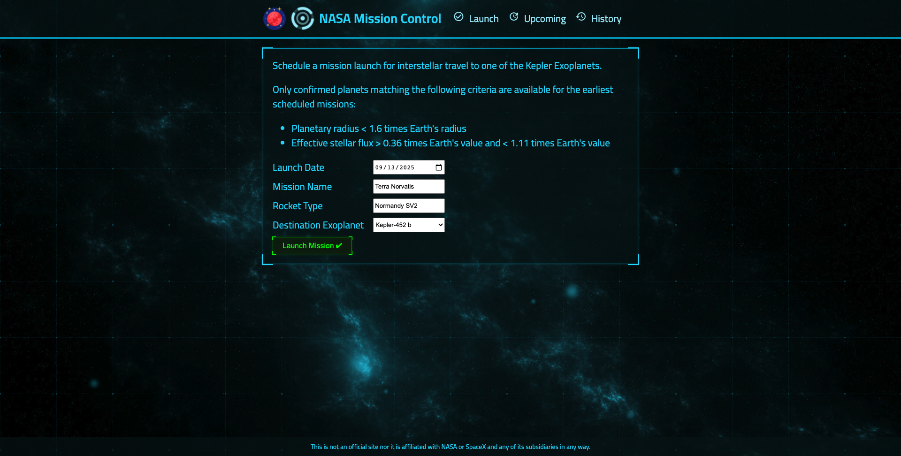

  <a href="#calling-about">About</a>&nbsp;&nbsp;&nbsp;|&nbsp;&nbsp;&nbsp;
  <a href="#eyes-preview">Preview</a>&nbsp;&nbsp;&nbsp;|&nbsp;&nbsp;&nbsp;
  <a href="#gear-core-tech-stack">Tech Stack</a>&nbsp;&nbsp;&nbsp;|&nbsp;&nbsp;&nbsp;
  <a href="#sparkles-main-features">Features</a>&nbsp;&nbsp;&nbsp;|&nbsp;&nbsp;&nbsp;
  <a href="#camera_flash-screenshots">Screenshots</a>&nbsp;&nbsp;&nbsp;|&nbsp;&nbsp;&nbsp;
  <a href="#memo-license-">License</a>&nbsp;&nbsp;&nbsp;|&nbsp;&nbsp;&nbsp;
  <a href="#warning-disclaimer">Disclaimer</a>

<h1 align="center">
  🚀 <em>NASA Mission Launch Control</em>
</h1>

  

 

## :calling: About

A mission control dashboard for managing interstellar space flight missions to "garden" planets flagged as a Kepler Object of Interest(KOIs). An unofficial project in collaboration with NASA and SpaceX, inspired by the [Artemis Program](https://www.nasa.gov/specials/artemis/ 'Artemis Program') and [Mars & Beyond Program](https://www.spacex.com/human-spaceflight/mars/ 'Mars & Beyond').

The application consists of three page sections - Launch, Upcoming & History. The homepage, also known as the application Launch section, is where users can create and schedule their space flight missions to a selection of KOI planets. All confirmed scheduled missions will display in the Upcoming section.

The Upcoming section consists of all upcoming missions scheduled by the user, including any mission data return by the SpaceX API. Users are also able to abort any of the space flight missions in this section by clicking on the :x: logo aligned to the left of each individual mission. Any manually cancelled mission by the user will be automatically flagged as a failed mission.

The History section consists of all past missions starting from the year 2006. Users are able to see all previous mission data and its status in this section. To identify mission status, a color-coded square marker is aligned to the left of each mission indicating their status; green colour for success and red colour for failure.

_**Note: Missions past the current date of viewing the application might still show up in the Upcoming mission list. This is due to the unofficial SpaceX API haven't been updated to reflect the latest & current data**_

This is a full-stack application with its core technologies based on the MERN Stack.

### :question: What is the MERN Stack?

MERN stands for MongoDB, Express, React, Node, after the four key technologies that make up the stack. It is a full-stack, following the traditional 3-tier architectural pattern, including the front-end display tier (React.js), application tier (Express.js and Node.js), and database tier (MongoDB).

- [MongoDB](https://www.mongodb.com/1 'MongoDB') - document database
- [Express(.js)](https://expressjs.com/ 'Express') - Node.js web framework
- [React(.js)](https://reactjs.org/ 'React') - a client-side JavaScript framework
- [Node(.js)](https://nodejs.org/en/ 'NodeJS') - the premier JavaScript web server

## :eyes: Preview

👉&nbsp; [NASA Misson Control](http://54.144.144.203:8000 'NASA Mission Control')

## :gear: Core Tech Stack

- :electron:&nbsp; [React](https://reactjs.org/ 'React.js')
- :link:&nbsp; [React Router](https://reactrouter.com/ 'React Router')
- :robot:&nbsp; [Arwes](https://arwes.dev/ 'Arwes')
- :electric_plug:&nbsp; [Express](https://expressjs.com/ 'Express.js')
- :file_cabinet:&nbsp; [MongoDB](https://www.mongodb.com/ 'MongoDB')
- :chipmunk:&nbsp; [Mongoose](https://mongoosejs.com/ 'Mongoose')
- :whale:&nbsp; [Docker](https://www.docker.com/ 'Docker')
- :orange_square:&nbsp; [AWS EC2](https://aws.amazon.com/ec2/?nc2=h_ql_prod_fs_ec2&ec2-whats-new.sort-by=item.additionalFields.postDateTime&ec2-whats-new.sort-order=desc 'Amazon EC2')

## :sparkles: Main Features

- Retrieve and display a list of space flights from an unofficial [SpaceX API](https://github.com/r-spacex/SpaceX-API 'SpaceX REST API')
- Space flights data are sorted by date, past flights in 'History' and upcoming flights in 'Upcoming'
- Launch dashboard for users to input their mission data and schedule new space flight missions
- Ability for users to manually cancel any upcoming missions in the 'Upcoming' section

## :camera_flash: Screenshots

## :memo: License 

This project is under the terms of the MIT license. For more information, please refer to the license [documentation](LICENSE.md).

## :warning: Disclaimer

This application uses an unofficial API that bares no official association, affiliation, authorization or endorsement of any kind to Space Exploration Technologies Corp (SpaceX) or any of its subsidiaries or its affiliates. The application was created purely for educational and entertainment purposes and serves only as a mockup to an actual space launch mission control program.

The contents of these pages are provided as an information guide only. While every effort is made in preparing the material for publication, no responsibility is accepted by or on behalf of the owner(s) for any errors, omissions or misleading statements on these pages or any site to which these pages connect. Although every effort is made to ensure the reliability of listed sites this cannot be taken as an endorsement of these sites.
